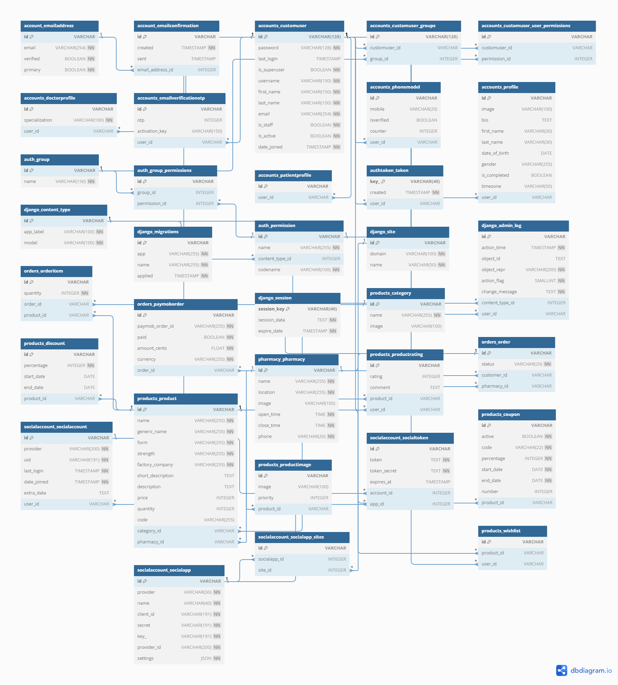
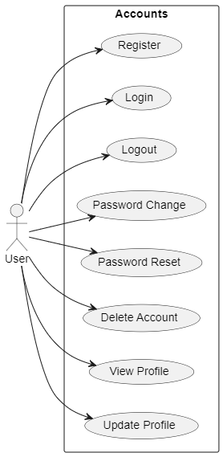
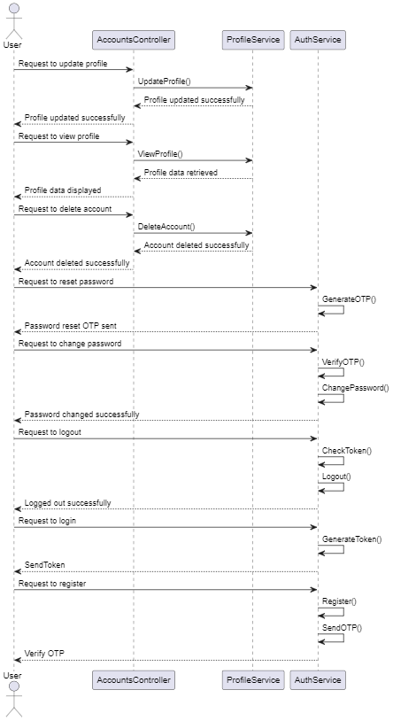
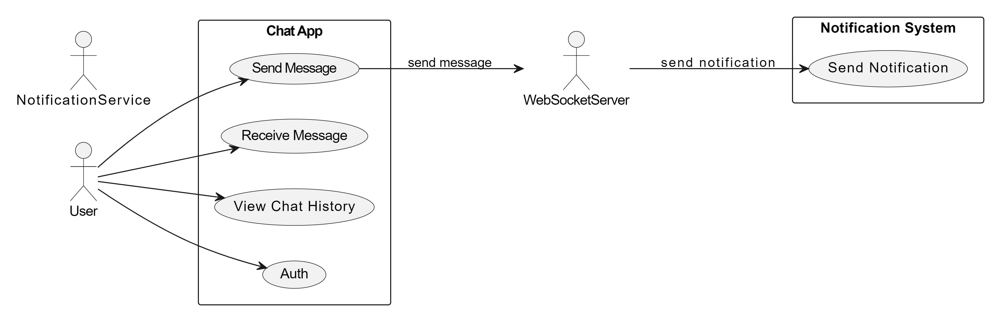

# E-commerce Smart Pharmacy

## Introduction

E-commerce Smart Pharmacy is a web application built using Django Rest Framework that facilitates the buying and selling of pharmaceutical products online. It provides features for users to browse products, place orders, manage prescriptions, and interact with pharmacies.

## Features

- User Authentication: Users can sign up, log in, and manage their accounts securely.
- Product Management: Admins can add, update, and delete products along with their details such as name, description, image, price, and category.
- Pharmacy Management: Admins can manage pharmacies by adding their information including name, location, contact details, and operating hours.
- Profile Management: Users can maintain their profiles by adding personal information such as first name, last name, date of birth, gender, and profile image.
- Prescription Handling: Users can upload prescriptions, which include details like patient name, doctor, medication, quantity, and total price.
- Order Management: Users can place orders for products and track their order history.
- Authentication and Authorization: Implemented authentication mechanisms to ensure secure access to the application's functionalities.

## Technologies Used

## Acknowledgements

- Django: The web framework used for development.
- Django Rest Framework: For building robust APIs.
- PostgreSQL: The relational database management system used.
- Django Allauth: For user authentication and registration.
- Dj-Rest-Auth: For user authentication and registration.
- Simple JWT: For user authentication and registration.
- Django Filters: For filtering data.
- Factory Boy: For generating test data.
- Faker: For generating test data.
- Django CORS: For handling cross-origin requests.
- Django UUID: For generating unique identifiers.
- Django ShortUUID: For generating unique identifiers.
- Swagger: For displaying API documentation.
- Docker: For building and running containers.
- Postman: For testing API endpoints.
- Git: For version control.
- Nginx: For serving static files.
- Github Actions: For automatic deployment.
- Azure: For hosting the application.

## Installation

1. Clone the repository: `git clone https://github.com/your/repository.git`
2. Install dependencies: `pip install -r requirements.txt`
3. Setup the database: `python manage.py migrate`
4. Run the server: `python manage.py runserver`

## API Endpoints

[link](https://ikseer.azurewebsites.net/swagger/)

## Usage

## Contributors

## License

This project is licensed under the [MIT License](https://opensource.org/licenses/MIT).

## Design

### db

## Accounts

### chat

